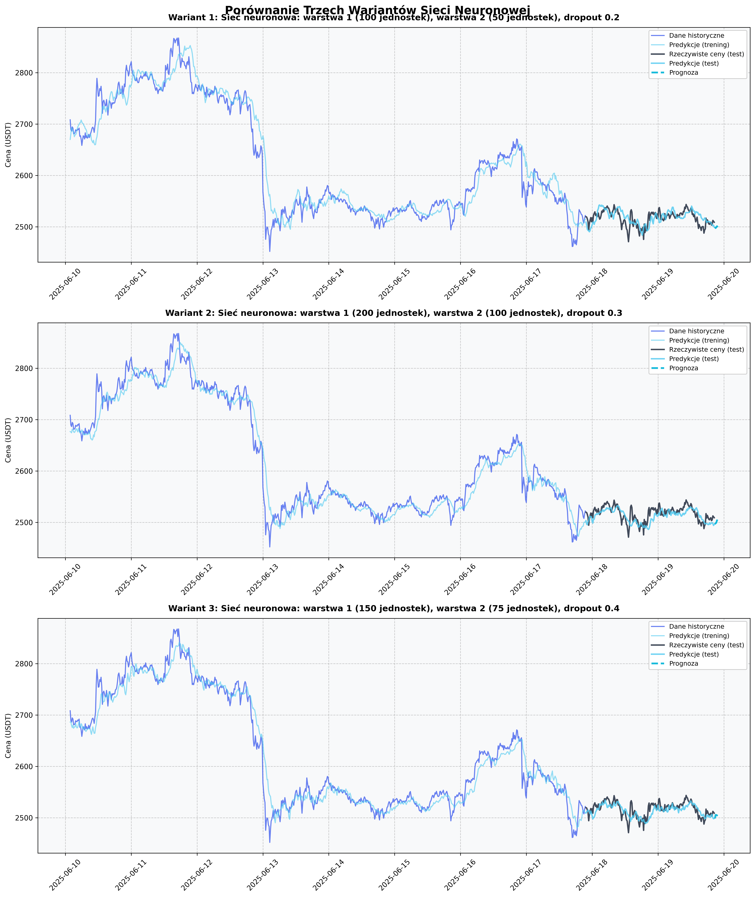

# Porównanie modeli predykcji - zmiana parametrów

## Parametry zmienione:

- Liczba jednostek: pierwsza warstwa 100, druga warstwa 50, dropout 0,2
- Liczba jednostek: pierwsza warstwa 200, druga warstwa 100, dropout 0,3
- Liczba jednostek: pierwsza warstwa 150, druga warstwa 75, dropout 0,4

## Wyniki
Wyniki predykcji i wykresy przedstawiono poniżej. Każdy wykres pokazuje wpływ zmiany parametrów na jakość predykcji.

## Wnioski
- Zmiana parametrów (okno, metoda, liczba kroków czasowych) wpływa na jakość predykcji.
- Średnia krocząca jest prosta, ale nie uwzględnia trendów.
- Trend liniowy lepiej radzi sobie z dłuższymi trendami, ale może nie przewidywać nagłych zmian.
- Wygładzanie wykładnicze jest kompromisem między prostotą a reagowaniem na zmiany.

---

Plik PDF z wykresami i opisem został wygenerowany automatycznie. 